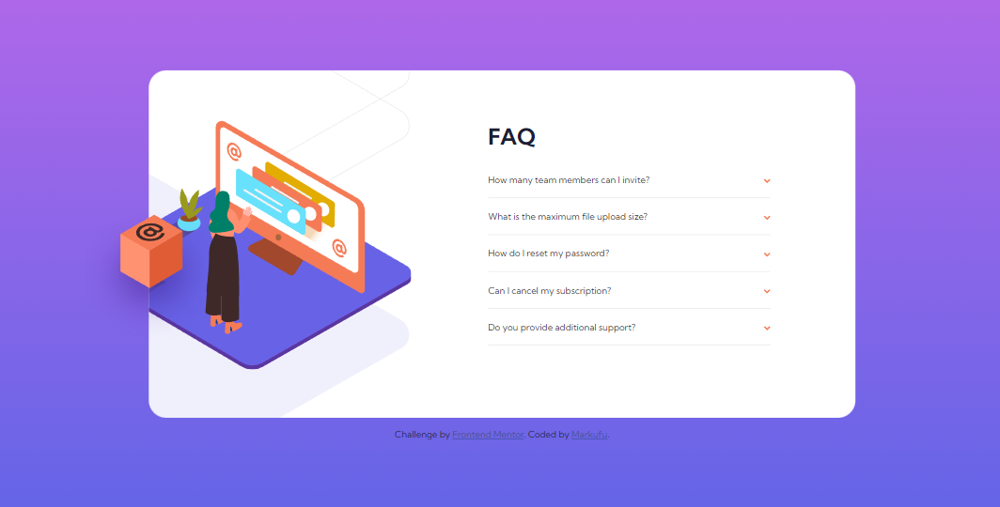
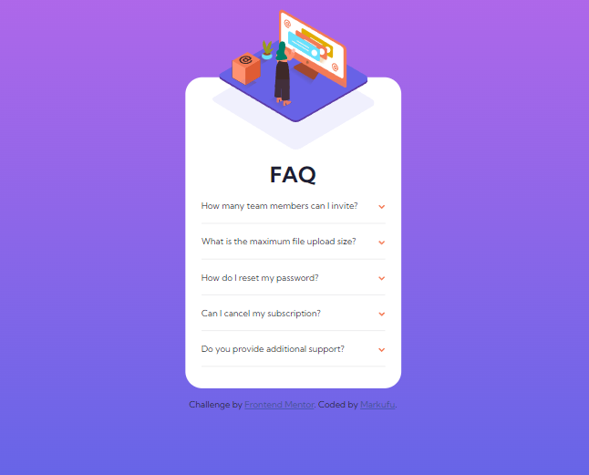

# Frontend Mentor - FAQ accordion card solution

This is a solution to the [FAQ accordion card challenge on Frontend Mentor](https://www.frontendmentor.io/challenges/faq-accordion-card-XlyjD0Oam). Frontend Mentor challenges help you improve your coding skills by building realistic projects. 

## Table of contents

- [Overview](#overview)
  - [The challenge](#the-challenge)
  - [Screenshot](#screenshot)
  - [Links](#links)
- [My process](#my-process)
  - [Built with](#built-with)
  - [What I learned](#what-i-learned)
  - [Continued development](#continued-development)
  - [Useful resources](#useful-resources)
- [Author](#author)
- [Acknowledgments](#acknowledgments)

## Overview

### The challenge

Users should be able to:

- View the optimal layout for the component depending on their device's screen size
- See hover states for all interactive elements on the page
- Hide/Show the answer to a question when the question is clicked

### Screenshot

### Links

- Solution URL: [Gitub](https://github.com/MrkDchvz/Front-end-mentor-solutions/tree/master/faq-accordion-card-main)
- Live Site URL: [Netlify](https://shimmering-khapse-d5b540.netlify.app)

## My process

### Built with

- Semantic HTML5 markup
- CSS custom properties
- Flexbox
- CSS Grid
- Mobile-first workflow
- [React](https://reactjs.org/) - JS library
- [Next.js](https://nextjs.org/) - React framework
- [Styled Components](https://styled-components.com/) - For styles

**Note: These are just examples. Delete this note and replace the list above with your own choices**

### What I learned
I re-learned DOM manipulation. Since I kind of forget it already due to not using it for a really long time. 

### Continued development
I want to focus on making an organized and easy to read code. I also want to focus on accessibility so I can cater to a lot of users. 

### Useful resources

- [Stack Overflow](https://stackoverflow.com/) - This helped me for getting solution on niche problems

## Author

- Frontend Mentor - [@Markufu](https://www.frontendmentor.io/profile/Markufuu)

## Acknowledgments

I would like to give my thanks to frontend mentors users who gave me feedback on my previous work. I was able to improve my solution thanks to their advice. 
