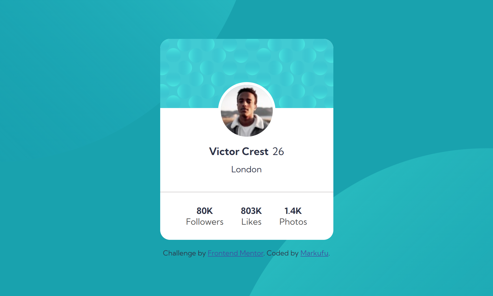
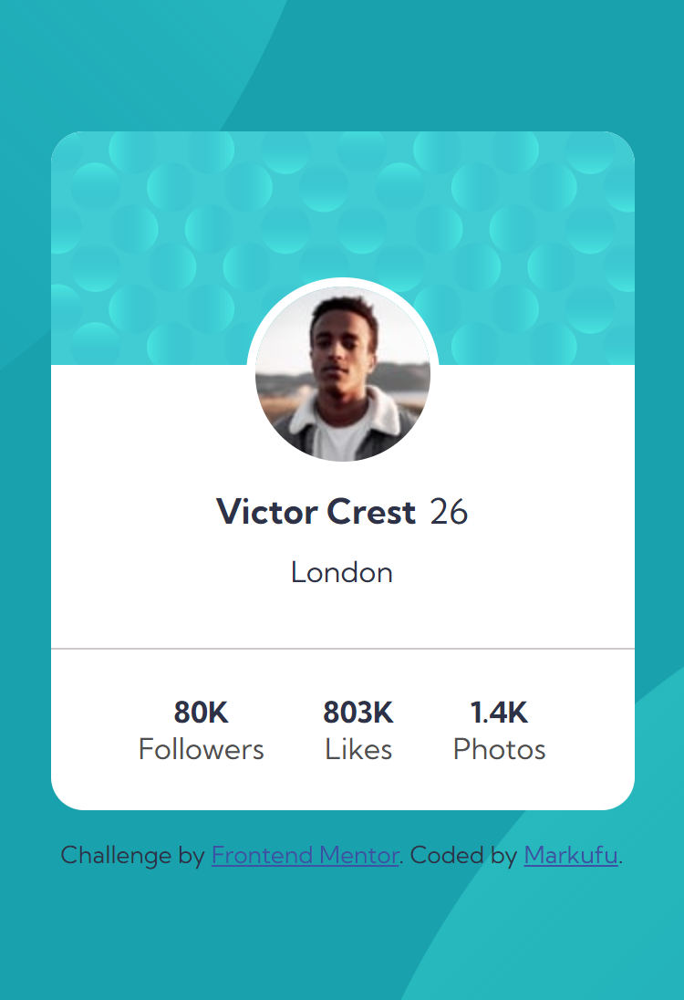

# Frontend Mentor - Profile card component solution

This is a solution to the [Profile card component challenge on Frontend Mentor](https://www.frontendmentor.io/challenges/profile-card-component-cfArpWshJ). Frontend Mentor challenges help you improve your coding skills by building realistic projects. 

## Table of contents

- [Overview](#overview)
  - [The challenge](#the-challenge)
  - [Screenshot](#screenshot)
  - [Links](#links)
- [My process](#my-process)
  - [Built with](#built-with)
  - [What I learned](#what-i-learned)
  - [Continued development](#continued-development)
  - [Useful resources](#useful-resources)
- [Author](#author)
- [Acknowledgments](#acknowledgments)

**Note: Delete this note and update the table of contents based on what sections you keep.**

## Overview

### The challenge

- Build out the project to the designs provided

### Screenshot





### Links

- Solution URL: [Github](https://github.com/MrkDchvz/Front-end-mentor-solutions/tree/master/01%20Newbie/profile-card-component-main/profile-card-component-main)
- Live Site URL: [Add live site URL here](https://your-live-site-url.com)

## My process

### Built with

- Semantic HTML5 markup
- CSS custom properties
- Flexbox
- CSS Grid
- Mobile-first workflow
- [React](https://reactjs.org/) - JS library
- [Next.js](https://nextjs.org/) - React framework
- [Styled Components](https://styled-components.com/) - For styles

**Note: These are just examples. Delete this note and replace the list above with your own choices**

### What I learned

In this challenge I learned to use CSS background properties such as background-image and background-position. For background-image I didn't know that you can actually put multiple images just seperate them with comma. For background position there are 4 properties: X position, X offset, Y position Y offset. Offset means the opposite direction meaning if you have left in your X position then you set 10px as your offset what will happen is that your bg-image will be moved to the right by 10px. You can also have a single property (X position) but your Y position will be defaulted to center. For two properties its: X position and Y position. You can set the background position of multiple images (if you have more than one image). You can seperate each bg-image with a comma (,).  

```css
body {
  background-color: var(--clr-dark-cyan);
  background-image: url(./images/bg-pattern-top.svg), url(./images/bg-pattern-bottom.svg);
  background-repeat: no-repeat;
  background-position: right 48vw bottom 45vh, left 45vw top 50vh;
}
```


### Continued development

This took me two days to solve. Mainly because I'm stuck at the SVG part. I can't properly make the SVGs to line up properly with the profile card and there are always overflow even if I set the parent container's overflow to hidden. I had to research on different way to solve this problem. I need to learn when to ask for help. As a spent doing this specific task for 2 days. Although persevering is a great practice but sometimes I guess its fine to throw the towel if things doesn't really make sense. The important thing is to learn from the solution compare it to my own solution to understand why this solution works while mine doesnt.

### Useful resources

- [Youtube](https://www.Youtube.com) - helped me to introduce to new concepts.
- [MDN](https://developer.mozilla.org/en-US/) helped me to learn new concepts in depth
- [Stackoverflow](https://stackoverflow.com/) - helped me to have find solution on niche problems 


## Author


- Frontend Mentor - [@Markufuu](https://www.frontendmentor.io/profile/Markufuu)


## Acknowledgments

I would like to thank the users of frontend mentor for their feedbacks. They point out the things that I need to improve on and as a result I'm improving slowly as a developer. 
