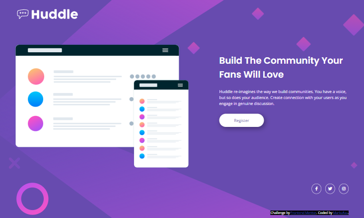
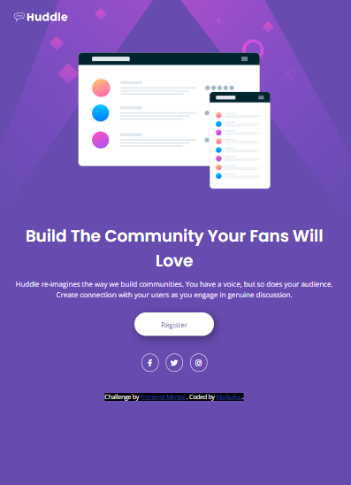

# Frontend Mentor - Huddle landing page with single introductory section solution

This is a solution to the [Huddle landing page with single introductory section challenge on Frontend Mentor](https://www.frontendmentor.io/challenges/huddle-landing-page-with-a-single-introductory-section-B_2Wvxgi0). Frontend Mentor challenges help you improve your coding skills by building realistic projects. 

## Table of contents

- [Overview](#overview)
  - [The challenge](#the-challenge)
  - [Screenshot](#screenshot)
  - [Links](#links)
- [My process](#my-process)
  - [Built with](#built-with)
  - [What I learned](#what-i-learned)
  - [Continued development](#continued-development)
  - [Useful resources](#useful-resources)
- [Author](#author)
- [Acknowledgments](#acknowledgments)

**Note: Delete this note and update the table of contents based on what sections you keep.**

## Overview

### The challenge

Users should be able to:

- View the optimal layout for the page depending on their device's screen size
- See hover states for all interactive elements on the page

### Screenshot





Add a screenshot of your solution. The easiest way to do this is to use Firefox to view your project, right-click the page and select "Take a Screenshot". You can choose either a full-height screenshot or a cropped one based on how long the page is. If it's very long, it might be best to crop it.

Alternatively, you can use a tool like [FireShot](https://getfireshot.com/) to take the screenshot. FireShot has a free option, so you don't need to purchase it. 

Then crop/optimize/edit your image however you like, add it to your project, and update the file path in the image above.

**Note: Delete this note and the paragraphs above when you add your screenshot. If you prefer not to add a screenshot, feel free to remove this entire section.**

### Links

- Solution URL: [Add solution URL here](https://your-solution-url.com)
- Live Site URL: [Add live site URL here](https://your-live-site-url.com)

## My process

### Built with

- Semantic HTML5 markup
- CSS custom properties
- Flexbox
- Mobile-first workflow
- InkScape 

**Note: These are just examples. Delete this note and replace the list above with your own choices**

### What I learned

Use this section to recap over some of your major learnings while working through this project. Writing these out and providing code samples of areas you want to highlight is a great way to reinforce your own knowledge.

To see how you can add code snippets, see below:

```html

  <main class="main">
    <div class="main-description">
      <h1 class="main-heading ff-poppins fw-600">Build The Community Your Fans Will Love</h1>
      <p class="main-sub-heading text-accent fw-400" style="line-height:1.5rem ;">Huddle re-imagines the way we build communities. You have a voice, but so does your audience. Create connection with your users as you engage in genuine discussion.</p>
      <a href="#" class="main-btn">Register</a>
    </div>
    
    <div class="main-img">
      
    </div>

\
```
```css


/*-----------------------*/
/*----Utility Classes----*/
/*-----------------------*/

/* Flex */
.flex {
    display: flex;
    justify-content: center;
}

/* Uppercase */
.uppercase {text-transform: uppercase;}

/* bg-color */
.bg-violet {background-color: var(--clr-violet);}
.bg-soft-magenta {background-color: var(--clr-soft-magenta);}

/* text-color */
.text-violet {color:var(--clr-violet);}
.text-soft-magenta {color: var(--clr-soft-magenta);}
.text-white {color: white;}
.text-accent { color:rgb(244, 230, 255);}

/*font-familes*/
.ff-poppins {font-family: var(--ff-poppins);}
.ff-open-sans {font-family:var(--ff-open-sans)};

/* font-weight */
.fw-400 {font-weight:400;}
.fw-600 {font-weight:600;}
```
```js
}
```

If you want more help with writing markdown, we'd recommend checking out [The Markdown Guide](https://www.markdownguide.org/) to learn more.

I learned how to design svg files using inkscape and use media queries for responsive layout.  I also learned how to import icons with cdnjs and font awesome

### Continued development
I need to study the fundamentals of css. Specially media queries and how to make proper breakpoints. I also need to learn how to make semantic html and css to make my code more readable. 
T

### Useful resources

- [Inkscape](https://inkscape.org/) - This helped me designing the background for both desktop and tablet background.
- [Font awesome](https://fontawesome.com/) - This is helped me to get social media icons.
-[Cdnjs](https://cdnjs.com/) - This helped importing the icons from fontawesome to my code. 


## Author

- Website - [Add your name here](https://www.your-site.com)
- Frontend Mentor - [@Markufuu](https://www.frontendmentor.io/profile/Markufuu)
- Twitter 
**Note: Delete this note and add/remove/edit lines above based on what links you'd like to share.**

## Acknowledgments

Thanks to Kevin Powell's videos for teaching me the foundations of responsive web design. 