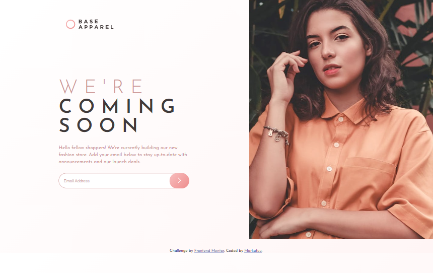

# Frontend Mentor - Base Apparel coming soon page solution

This is a solution to the [Base Apparel coming soon page challenge on Frontend Mentor](https://www.frontendmentor.io/challenges/base-apparel-coming-soon-page-5d46b47f8db8a7063f9331a0). Frontend Mentor challenges help you improve your coding skills by building realistic projects. 

## Table of contents

- [Overview](#overview)
  - [The challenge](#the-challenge)
  - [Screenshot](#screenshot)
  - [Links](#links)
- [My process](#my-process)
  - [Built with](#built-with)
  - [What I learned](#what-i-learned)
  - [Continued development](#continued-development)
  - [Useful resources](#useful-resources)
- [Author](#author)
- [Acknowledgments](#acknowledgments)

**Note: Delete this note and update the table of contents based on what sections you keep.**

## Overview

### The challenge

Users should be able to:

- View the optimal layout for the site depending on their device's screen size
- See hover states for all interactive elements on the page
- Receive an error message when the `form` is submitted if:
  - The `input` field is empty
  - The email address is not formatted correctly

### Screenshot

### Links

- Solution URL: [Github](https://github.com/MrkDchvz/Front-end-mentor-solutions/tree/master/base-apparel-coming-soon-master)
- Live Site URL: [Netlify](https://rad-sfogliatella-13594d.netlify.app)

## My process

### Built with

- Semantic HTML5 markup
- Flexbox
- Mobile-first workflow

### What I learned
I learned how to make a custom designed textbox with its button inside. I also learned to simplfy my code, So other people can understand it. 

### Continued development
I want to focus on writing simple and readable code. Also, I want to improve more on CSS and semantic HTML

### Useful resources

- [Stack overflow](https://stackoverflow.com/) - This helped me answering niche problems and was able to learn about the problem indepth and why does a solution fixes that problem. 

## Author
- Frontend Mentor - [@Markufuu](https://www.frontendmentor.io/profile/Markufuu)

## Acknowledgments

I would like to give my thanks to @adonmez04 for giving me feedback on my previous challenge and I was able to apply it in this challenge. 