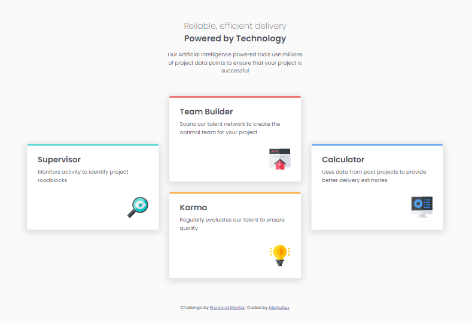

# Frontend Mentor - Four card feature section solution

This is a solution to the [Four card feature section challenge on Frontend Mentor](https://www.frontendmentor.io/challenges/four-card-feature-section-weK1eFYK). Frontend Mentor challenges help you improve your coding skills by building realistic projects. 

## Table of contents

- [Overview](#overview)
  - [The challenge](#the-challenge)
  - [Screenshot](#screenshot)
  - [Links](#links)
- [My process](#my-process)
  - [Built with](#built-with)
  - [What I learned](#what-i-learned)
  - [Continued development](#continued-development)
  - [Useful resources](#useful-resources)
- [Author](#author)
- [Acknowledgments](#acknowledgments)

**Note: Delete this note and update the table of contents based on what sections you keep.**

## Overview

### The challenge

Users should be able to:

- View the optimal layout for the site depending on their device's screen size

### Screenshot




### Links

- Solution URL: [Github](https://github.com/MrkDchvz/Front-end-mentor-solutions/tree/master/four-card-feature-section-master)
- Live Site URL: [Netlify](https://incandescent-scone-b70ee7.netlify.app)

## My process

### Built with

- Semantic HTML5 markup
- Flexbox


### What I learned

I learned that not all 2 dimensional layouts are solvable by grid. I tried to use grid on this one but it doesn't work. I wasn't able to make the gap between the vertical elements close and in order to do that I have to create a large grid. That's why I settled with flexbox instead. So there are 4 cards and they have to be in a cross layout. the 2 cards in the middle are in vertical arrangement while the first and last card is in horizontal, thus a cross-like structure. What I did is to wrap the 2 cards in the middle with a div so when I turned the card container (parent) into display: flex  the 2 cards inside the wrapped div won't become a flex child (meaning they are still block elements stacked with each other). with that Instead of 4 flex children I'll only have 3 flex children they are lined in the main axis (horizontal, because the default flex direction is row).

```html
  <main class="card-container">
    <section class="card card--supervisor">
      <h2 class="card__header">Supervisor</h2>
      <p class="card__description">Monitors activity to identify project roadblocks
      </p>
      
    </section>

    <div class="vertical">
      <section class="card card--team-builder">
        <h2 class="card__header">Team Builder</h2>
        <p class="card__description">Scans our talent network to create the optimal team for your project</p>
        
      </section>

      <section class="card card--karma">
        <h2 class="card__header">Karma</h2>
        <p class="card__description">Regularly evaluates our talent to ensure quality
        </p>
        
      </section>
    </div>

    <section class="card card--calculator">
      <h2 class="card__header">Calculator</h2>
      <p class="card__description">Uses data from past projects to provide better delivery estimates</p>
      
    </section>
  </main>
```
```css
@media (min-width: 90rem) {
  .card-container {
    display: flex;
    align-items: center;
    justify-content: center;
    gap: 2rem;
  }

  .card--team-builder {
    margin-bottom: 2rem;
  }
}
```


### Continued development
Although, I used flexbox in this challenge. I really want to practice my grid skills but I don't have any idea on how to make a cross structure with narrow gap into grid like this. For now I'll ask the community with their insights and try to complete this challenge with grid.

### Useful resources

- [Mozilla Documentation](https://developer.mozilla.org/en-US/) - A documentation for CSS, HTML, and JS that explains the fundamentals with such depth. Helped me understand the properties and make them more transparent rather than a blackbox that inputs some sort of output. 


## Author


- Frontend Mentor - [@Markufuu](https://www.frontendmentor.io/profile/Markufuu)


## Acknowledgments

This is where you can give a hat tip to anyone who helped you out on this project. Perhaps you worked in a team or got some inspiration from someone else's solution. This is the perfect place to give them some credit.

**Note: Delete this note and edit this section's content as necessary. If you completed this challenge by yourself, feel free to delete this section entirely.**
