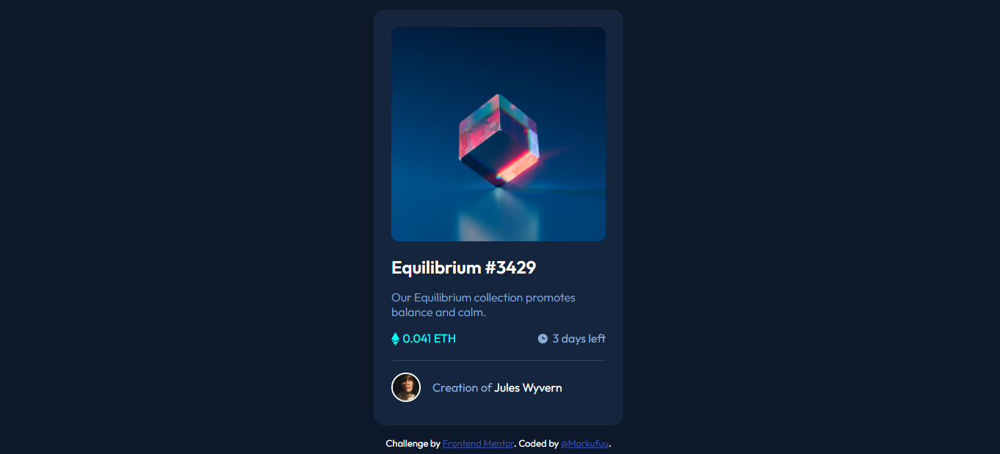

# Frontend Mentor - NFT preview card component solution

This is a solution to the [NFT preview card component challenge on Frontend Mentor](https://www.frontendmentor.io/challenges/nft-preview-card-component-SbdUL_w0U). Frontend Mentor challenges help you improve your coding skills by building realistic projects. 

## Table of contents

- [Overview](#overview)
  - [The challenge](#the-challenge)
  - [Screenshot](#screenshot)
  - [Links](#links)
- [My process](#my-process)
  - [Built with](#built-with)
  - [What I learned](#what-i-learned)
  - [Continued development](#continued-development)
  - [Useful resources](#useful-resources)
- [Author](#author)
- [Acknowledgments](#acknowledgments)

## Overview

### The challenge

Users should be able to:

- View the optimal layout depending on their device's screen size
- See hover states for interactive elements

### Screenshot

### Links

- Solution URL: [Add solution URL here](https://github.com/MrkDchvz/Front-end-mentor-solutions/tree/master/nft-preview-card-component-main)
- Live Site URL: [Add live site URL here](https://idyllic-conkies-9f466c.netlify.app)

## My process

### Built with

- Semantic HTML5 markup
- CSS custom properties
- Flexbox
- Mobile-first workflow

### What I learned

Thanks to the feedback of other people on my previous work I was able to use semantic html tags on my work. 

### Continued development

I'll focus on learning to make an organized and human-readable code. 

### Useful resources

## Author

- Frontend Mentor - [@Markufuu](https://www.frontendmentor.io/profile/Markufuu)

## Acknowledgments

I want to acknowledge @0xAbdulKhalid of front-end mentor for giving me feedback on my previous work that I was able to apply here. 
