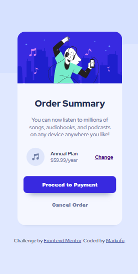

# Frontend Mentor - Order summary card solution

This is a solution to the [Order summary card challenge on Frontend Mentor](https://www.frontendmentor.io/challenges/order-summary-component-QlPmajDUj). Frontend Mentor challenges help you improve your coding skills by building realistic projects. 

## Table of contents

- [Overview](#overview)
  - [The challenge](#the-challenge)
  - [Screenshot](#screenshot)
  - [Links](#links)
- [My process](#my-process)
  - [Built with](#built-with)
  - [What I learned](#what-i-learned)
  - [Continued development](#continued-development)
  - [Useful resources](#useful-resources)
- [Author](#author)
- [Acknowledgments](#acknowledgments)

**Note: Delete this note and update the table of contents based on what sections you keep.**

## Overview

### The challenge

Users should be able to:

- See hover states for interactive elements

### Screenshot

### Links

- Solution URL: [Add solution URL here](https://your-solution-url.com)
- Live Site URL: [Add live site URL here](https://your-live-site-url.com)

## My process

### Built with

- Semantic HTML5 markup
- Flexbox
- Mobile-first workflow

### What I learned
I learned how to make a custom box shadow of my own. Before I'm using those other people made. 
### Continued development
I'm planning to improve creating a simple, clean and human readable code. That's why I need to learn how to avoid overcomplicating things
### Useful resources

- [MDN Documentation](https://developer.mozilla.org/) - This helped me to learn CSS/HTML/JS Properties in depth. 
- [StackOverflow](https://stackoverflow.com/) - This helped me solve niche problems that other people already encounter. 

## Author

- Frontend Mentor - [@Markufuu](https://www.frontendmentor.io/profile/Markufuu)

- Github - [@Markdchvz](https://github.com/MrkDchvz);
## Acknowledgments

As usual I would like to give my gratitude to front end mentor users that gave me feedback on my previous solutions. 
